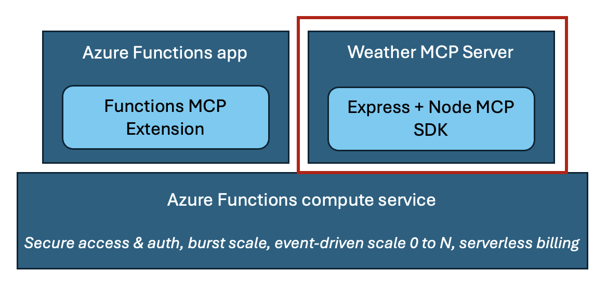
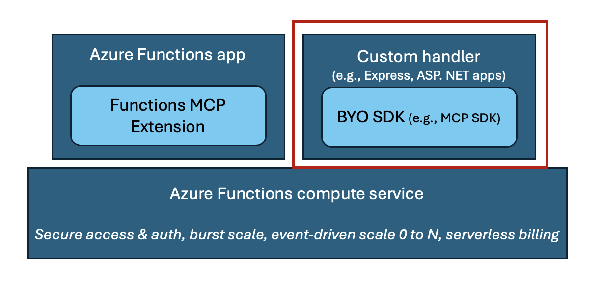

# Host remote MCP servers built with official MCP SDKs on Azure Functions

This repo contains instructions and sample for running MCP server built with the Node MCP SDK on Azure Functions. The repo uses the weather sample server to demonstrate how this can be done. You can clone to run and test the server locally, follow by easy deploy with `azd up` to have it in the cloud in a few minutes. 

## Running MCP server as custom handler on Azure Functions

Recently Azure Functions released the [Functions MCP extension](https://techcommunity.microsoft.com/blog/appsonazureblog/build-ai-agent-tools-using-remote-mcp-with-azure-functions/4401059), allowing developers to build MCP servers using Functions programming model, which is essentially Function's event-driven framework, and host them remotely on the serverless platform. 

For those who have already built servers with [Anthropic's MCP SDKs](https://github.com/modelcontextprotocol/servers?tab=readme-ov-file#model-context-protocol-servers), it's also possible to host the servers on Azure Functions by running them as _custom handlers_, which are lightweight web servers that receive events from the Functions host. They allow you to host your already-built MCP servers with minimal code change and benefit from Function's bursty scale, serverless pricing model, and security features. 

This repo focuses on the second hosting scenario:  

<div align="center">
  
</div>

More generally speaking, you can leverage custom handlers to host apps built with your choice of frameworks and SDKs on Azure Functions:

<div align="center">
  
</div>

## Prerequisites

You'll need an [Azure subscription](../guides/developer/azure-developer-guide.md#understanding-accounts-subscriptions-and-billing). If you don't already have an account, [create a free one](https://azure.microsoft.com/free/dotnet/) before you begin.

Ensure you have the following installed: 

* [Azure Developer CLI](https://learn.microsoft.com/azure/developer/azure-developer-cli/install-azd)
* [Azure Functions Core Tools](https://learn.microsoft.com/azure/azure-functions/functions-run-local?tabs=windows%2Cisolated-process%2Cnode-v4%2Cpython-v2%2Chttp-trigger%2Ccontainer-apps&pivots=programming-language-typescript) 
* [Visual Studio Code](https://code.visualstudio.com/) 
* [Azure Functions extension on Visual Studio Code](https://marketplace.visualstudio.com/items?itemName=ms-azuretools.vscode-azurefunctions) 

### Run the server locally

1. Clone the repo
    ```
    git clone https://github.com/Azure-Samples/mcp-sdk-functions-hosting-node.git
    ```
1. Open up the sample in VSCode, run `npm install` in the root directory
1. Run `func start` to start the MCP server locally
1. Open _mcp.json_ (in the _vscode_ directory) and click the Start button above the **local-mcp-server**
1. Click on the Copilot icon at the top and change to _Agent_ mode in the question window. 
1. Ask "What is the weather in NYC?" Copilot should call one of the weather tools to help answer this question. 

### Deploy 

In the root directory, and run `azd up`. This command will create and deploy the app, plus other required resources. 

When the command finishes, your terminal will display output similar to the following:

  ```shell
  (✓) Done: Deploying service api
  - Endpoint: https://{functionapp-name}.azurewebsites.net/
  ```

### Connect to server on Visual Studio Code

1. After deployment completes, navigate to the Function App resource in the Azure portal, as you will need the key from there.
1. Open _mcp.json_ in VS Code.
1. Stop the local server by selecting the _Stop_ button above the **local-mcp-server**
1. Start the remote server by selecting the _Start_ button above the **remote-mcp-server**
1. VS Code will prompt you for the Function App name. Copy it from either the terminal output or the Portal.
1. VS Code will next prompt you for the Function App key. Copy that from the _default_ key on the **Functions** -> **App keys** page in the Azure portal.

>[!TIP]
>In addition to starting an MCP server in _mcp.json_, you can see output of a server by clicking **More..._ -> _Show Output**. The output provides useful information like why a connection might've failed.

## Server authorization using Azure API Management (APIM)

In addition to protecting server access through function keys, you can also add APIM in front of the Function app to add an extra layer of security. This sample leverages APIM's policy feature to redirect a client to authenticate with Entra ID before connecting to the MCP server. Specifically, this is achieved by creating two policies on the APIM resource that follow the [MCP authorization specification](https://modelcontextprotocol.io/specification/2025-06-18/basic/authorization#authorization-server-discovery). One policy checks access tokens from incoming requests, and if validation fails, returns a 404 with header containining the path to Protected Resource Metadata (PRM). Another policy returns the PRM, which a client can use to figure out the authorization server (Entra ID in this case) that provides access tokens to the MCP server.

To see the above in action, test connecting to the server using the APIM endpoint instead of the Function app endpoint:

1. Open _mcp.json_ in VS Code
1. Stop the **remote-mcp-server** or **local-mcp-server** servers if still running
1. Start the **remote-mcp-server-apim** server
1. VS Code will prompt you for the APIM resource name
1. Click **Allow** when a window pops up saying the MCP Server wants to authenticate to Microsoft.
1. Sign into your Microsoft account to connect to the server  

### Support for other clients

Since Entra ID doesn't provide native support for DCR (Dynamic Client Registration) and PKCE (Proof Key for Code Exchange) today,the above authorization flow is only supported on VS Code. If you use other clients (like Claude or Cursor), the easier option is to access the MCP server using the Function App endpoint and access key. The other option is to try out an [experimental approach](https://github.com/localden/remote-auth-mcp-apim-py/) that provides a workaround, which also leverages APIM.

## Next steps

### Find this sample in other languages

| Language (Stack) | Repo Location |
|------------------|---------------|
| C# (.NET) | [mcp-sdk-functions-hosting-dotnet](https://github.com/Azure-Samples/mcp-sdk-functions-hosting-dotnet) |
| Python | [mcp-sdk-functions-hosting-python](https://github.com/Azure-Samples/mcp-sdk-functions-hosting-python) |

### Bring-your-own MCP server

If you've already built an MCP server, follow the instructions in the document [Host bring-your-own (BYO) MCP servers on Azure Functions
](https://github.com/Azure-Samples/mcp-sdk-functions-hosting-node/blob/main/BYOServer.md). 